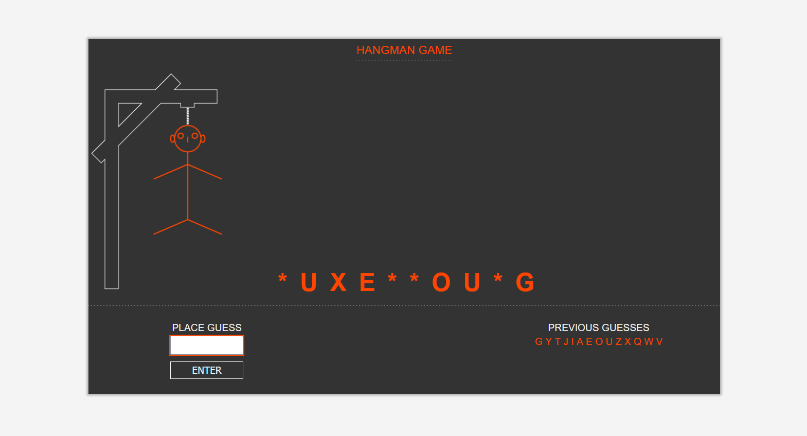

# Hangman game
The goal of the <a href="https://ivanmpr.github.io/Hangman-game/"> game <a/> is to guess the hidden word (in this case actually, to guess the names of the random world countries).
Player has 10 times to try and reveal hidden city. Previous guesses are stored and visible in UI, and for every miss, one additional part of the body is hanged...
Enjoy the game !
 

